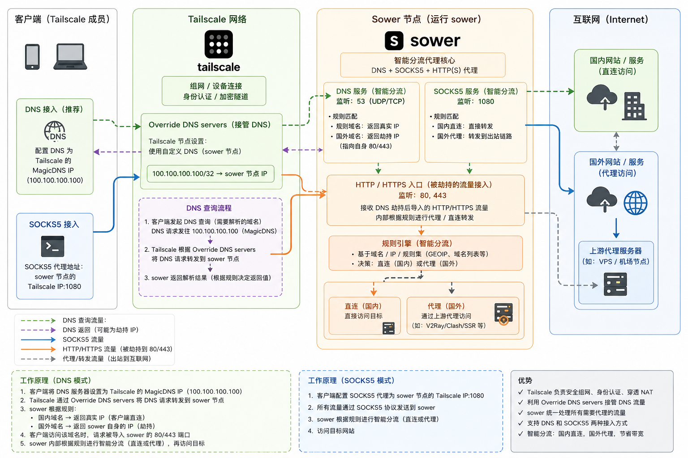

# sower

[](https://github.com/sower-proxy/sower/releases)
[](https://github.com/sower-proxy/sower/actions)
[](https://github.com/sower-proxy/sower/issues)
[](https://github.com/sower-proxy/sower/stargazers)
[](LICENSE)

Sower 是一个跨平台的智能分流代理工具。

它可以同时提供：

- DNS 分流：客户端先问 Sower 域名怎么解析，Sower 根据规则决定直连还是代理。
- HTTP/HTTPS 透明代理：DNS 模式下，Sower 可以接住被导向自己的 `80/443` 流量，再按规则转发。
- SOCKS5 代理：把 Sower 当成一个普通的 `socks5h` 代理使用，也能享受同一套分流规则。

如果你已经有机场、VPS、Clash、V2Ray、SSR 或其它 SOCKS5 上游，推荐先把 Sower 当成“内网智能分流节点”使用，不一定要部署 `sowerd`。

## 推荐用法一：Tailscale + Sower 节点

对新手来说，最省事的方式是：选一台常开的设备运行 `sower`，让它加入 Tailscale，其它手机、电脑、平板也加入同一个 Tailscale 网络。



这个方案的核心思路很简单：

1. Tailscale 负责组网、身份认证和加密通道。
2. Sower 节点负责 DNS、SOCKS5 和智能分流。
3. 普通客户端不用暴露在公网里，只需要连上同一个 Tailscale 网络。
4. 国内网站按规则直连，国外网站按规则走上游代理。

### 适合谁

- 你有多台设备，不想在每台设备上单独维护复杂代理规则。
- 你已经有一个可用的上游代理，只想让 Sower 统一分流。
- 你不想把代理入口直接暴露到公网，只想在自己的 Tailscale 网络里使用。

### 工作方式

推荐同时使用两种入口：

- DNS 入口：客户端 DNS 指向 Tailscale 的 MagicDNS 地址 `100.100.100.100`，Tailscale 再把 DNS 请求转给 Sower 节点。
- SOCKS5 入口：需要手动设置代理的软件，直接使用 `socks5h://<Sower 节点的 Tailscale IP>:1080`。

DNS 模式下，Sower 会这样处理域名：

- 命中直连规则：返回真实 IP，客户端直接访问目标网站。
- 命中代理规则：返回 Sower 节点自己的 IP，客户端访问该 IP 的 `80/443`，Sower 再根据域名或 TLS SNI 转发到上游代理。
- 命中阻断规则：直接返回 DNS 错误。

SOCKS5 模式下，客户端把请求交给 Sower，Sower 再根据同一套路由规则决定直连或代理。

### Sower 节点配置

先复制示例配置：

```shell
cp config/sower.toml sower.toml
```

然后重点修改这几处：

```toml
[remote]
type = "socks5"
addr = "127.0.0.1:7890"
password = ""

[dns]
disable = false
serve = "<Sower 节点的 Tailscale IP>"
fallback = "223.5.5.5"

[socks_5]
disable = false
addr = "<Sower 节点的 Tailscale IP>:1080"
```

说明：

- 如果上游代理就在同一台机器上，例如 Clash 本地 SOCKS5 是 `127.0.0.1:7890`，就按上面这样写。
- 如果上游代理在另一台机器上，把 `remote.addr` 改成对应的 `host:port`。
- 如果你使用的是 `sowerd` 或 `trojan` 上游，把 `remote.type` 改成 `sower` 或 `trojan`，并按你的服务端信息填写 `remote.addr` 和 `remote.password`。
- `dns.serve` 会同时决定 Sower 的 DNS 入口，以及 DNS 模式下 HTTP/HTTPS 透明代理监听的 IP。

启动：

```shell
sudo sower -c sower.toml
```

`sower` 通常需要 root 权限，因为 DNS 模式会监听 `53/udp`、`80/tcp` 和 `443/tcp`。SOCKS5 入口会监听你在 `[socks_5]` 中配置的地址。

如果你把监听地址写成 `0.0.0.0`，必须用系统防火墙限制只允许 Tailscale 网络访问。更简单的做法是直接绑定 Sower 节点的 Tailscale IP。

### Tailscale DNS 设置

在 Tailscale 的 DNS 设置里，把 Sower 节点的 Tailscale IP 配成自定义 DNS 服务器，并开启“覆盖本机 DNS”。

客户端侧保持使用 Tailscale 的 MagicDNS 地址：

```text
100.100.100.100
```

这样客户端发出的 DNS 请求会先进 Tailscale，再被转发到 Sower 节点。

### 客户端代理设置

如果软件支持 SOCKS5，推荐写成：

```text
socks5h://<Sower 节点的 Tailscale IP>:1080
```

这里的 `socks5h` 很重要：它表示域名解析也交给代理端处理。这样 Sower 才能根据域名做分流，客户端也不会把需要代理的域名提前解析掉。

## 推荐用法二：家庭或办公子网透明分流

如果你的设备都在同一个局域网里，例如家庭网络、小型办公室、实验室网络，也可以把 Sower 放在子网内，然后在路由器上修改 DNS。

这种方式的目标是：手机、电脑、电视等设备不单独配置代理，只要连上这个 Wi-Fi 或有线网络，就自动使用 Sower 做 DNS 分流和 HTTP/HTTPS 透明代理。

### 网络结构

假设你的局域网是：

- 路由器网关：`192.168.1.1`
- Sower 节点：`192.168.1.2`
- 普通客户端：`192.168.1.x`

工作流程是：

1. 路由器通过 DHCP 把 DNS 下发为 `192.168.1.2`。
2. 客户端访问网站前，先向 `192.168.1.2` 查询 DNS。
3. Sower 根据规则判断这个域名应该直连、代理还是阻断。
4. 直连域名返回真实 IP，客户端直接访问。
5. 代理域名返回 Sower 节点 IP，客户端后续访问 `192.168.1.2:80/443`。
6. Sower 接住 HTTP/HTTPS 流量，再转发到上游代理。

### Sower 节点配置

复制示例配置：

```shell
cp config/sower.toml sower.toml
```

重点修改：

```toml
[remote]
type = "socks5"
addr = "127.0.0.1:7890"
password = ""

[dns]
disable = false
serve = "192.168.1.2"
fallback = "223.5.5.5"

[socks_5]
disable = false
addr = "192.168.1.2:1080"
```

把 `192.168.1.2` 换成你的 Sower 节点局域网 IP。

启动：

```shell
sudo sower -c sower.toml
```

Sower 节点需要能监听 `53/udp`、`80/tcp`、`443/tcp` 和 `1080/tcp`。如果系统防火墙开启了，需要允许局域网设备访问这些端口。

### 路由器设置

在路由器的 DHCP 设置里，把下发给客户端的 DNS 服务器改成：

```text
192.168.1.2
```

不同路由器界面名称不一样，常见名称包括：

- DHCP DNS
- LAN DNS
- 自定义 DNS 服务器
- DNS 服务器 1

不要只改路由器自己的“上游 DNS”。要改的是“通过 DHCP 发给局域网客户端的 DNS”。否则客户端可能仍然拿到路由器 IP 作为 DNS，Sower 不会接到查询。

修改后，让客户端重新连接 Wi-Fi，或者更新 DHCP 租约。确认客户端 DNS 已经变成 Sower 节点 IP。

### 建议的路由器限制

如果你想让全子网都稳定走这套透明分流，路由器上还应该限制几类绕过路径：

- 拦截或阻断客户端直接访问外部 `53/udp` 和 `53/tcp`，只允许访问 Sower 节点的 DNS。
- 阻断常见 DoH/DoT，或者在客户端浏览器里关闭“安全 DNS”。
- 阻断 `443/udp`，避免 QUIC 绕过 Sower 的 TCP `443` 透明代理；浏览器通常会回退到 TCP HTTPS。

这些限制不是 Sower 自己完成的，需要路由器、防火墙或网关设备支持。

### 适合和不适合的场景

适合：

- 家庭网络里想让大多数设备自动分流。
- 小型办公网络里想集中维护规则。
- 电视、游戏机、IoT 设备不方便单独配置 SOCKS5。

不适合：

- 客户端强制使用内置 DoH/DoT，且你无法关闭或阻断。
- 应用直接访问固定 IP，不经过 DNS。
- 网络里已经有复杂网关策略，且不能修改 DHCP DNS 或防火墙规则。

这个方案的前提是客户端愿意使用路由器下发的 DNS。只改 DNS 不是万能透明代理；它依赖域名解析把需要代理的 HTTP/HTTPS 流量导向 Sower。

## 传统用法：部署 sowerd

如果你想自己搭一台 Sower 服务端，可以部署 `sowerd`。

`sowerd` 运行在服务端，像一个 Web 代理服务，会监听：

- `80/tcp`
- `443/tcp`

它会在启动时校验配置，日志中会脱敏敏感字段。如果 `80/443` 监听失败，进程会直接退出，不会假装启动成功。

`sowerd` 可以使用你自己的证书，也可以通过 Let's Encrypt 自动申请证书。

如果 `sowerd` 作为 systemd 服务运行，且环境里没有 `HOME` 或 `XDG_CACHE_HOME`，证书缓存会退回到 `/var/cache/sower`。

当 `fake_site` 指向本地目录时，`sowerd` 只会通过 `127.0.0.1:80` 的回退流量服务这个目录；公网 HTTP 流量仍会重定向到 HTTPS。

启动方式有两种。

直接运行：

```shell
sudo sowerd -password XXX -fake_site 127.0.0.1:8080
```

交互式安装为 systemd 服务：

```shell
sudo sowerd -i
```

安装器可以复制当前二进制到 `/usr/local/bin/sowerd`，写入 `/etc/systemd/system/sowerd.service`，在缺少配置时创建 `/etc/sower/sowerd.toml`，并按提示决定是否立即启动服务。

## 规则和配置补充

`sower.toml` 是默认示例配置。完整示例见 [config/sower.toml](./config/sower.toml)。

几个容易踩坑的点：

- 远程规则文件会通过上游代理下载，不会直接出网。
- 远程规则加载失败时，`sower` 会启动失败，不会带着不完整规则继续运行。
- `router.country.mmdb` 是可选项，留空表示关闭 GeoIP，只使用配置里的 CIDR 规则。
- HTTPS 透明代理只读取 TLS ClientHello 里的 SNI，不会在本机解密或终止 TLS。
- `sower` 和 `trojan` 上游的 `remote.addr` 可以写 `host`，也可以写 `host:port`。
- `remote.tls` 可以设置 SNI、跳过证书校验，或使用 `chrome`、`firefox` 等 uTLS 指纹。
- 规则文件可以用 `file_skip_rules` 跳过第三方列表中的个别条目。例如在 `[router.block]` 中写 `file_skip_rules = ["t.co"]`。

## 架构


更详细的架构、边界和数据流说明见 [ARCHITECTURE.md](./ARCHITECTURE.md)。
